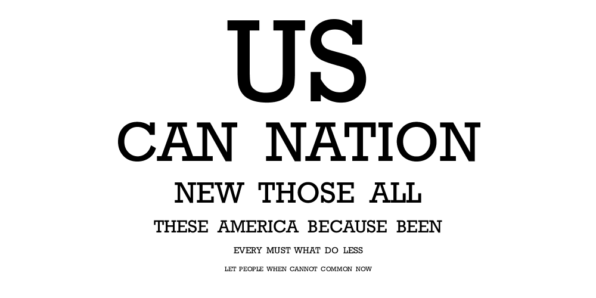
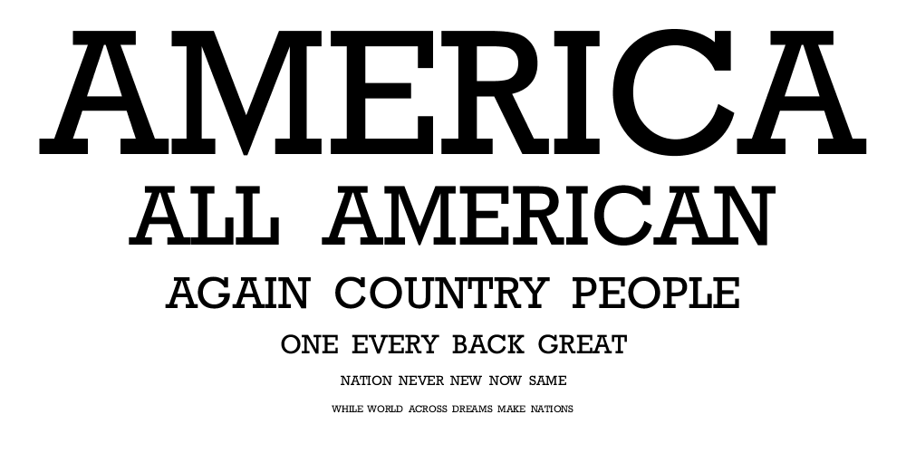
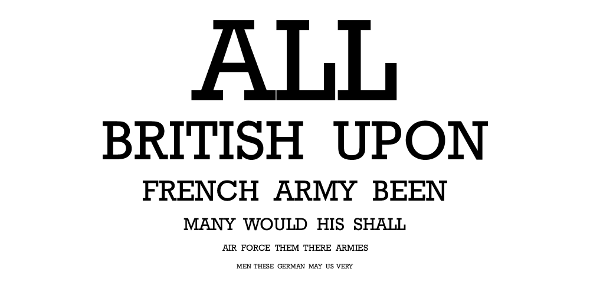

# Eye Chart Project

In this project, you will practice modular programming by using pre-defined
methods according to their specifications. As with your previous project, this
will be accomplished using the Processing environment, and your finished
project will be an artistic _Eye Chart_.

## Description

Your task is to convert a famous speech or bit of literature into an
aesthetically pleasing Eye Chart. From whatever text you select, you should
determine the most used word (methods for this will be supplied here) and type
it in large font at the top of the Eye Chart. Lesser-used words should appear
beneath it in smaller font. Some examples of finished products are below.

## Examples

**President Obama's First Inaugural Address**

**President Trump's Inaugural Address**

**Winston Churchill's _Fight on the Beaches_ Speech**

## Instructions

So how do you make this happen? I suppose that's for you to figure out! Don't
worry though, you have a couple of resources to help. The first is the helper
code in this project. You should copy and paste it straight from this
repository directly into your Processing project. _Do not Edit it_! This will
only make it stop working.

I don't expect you to know how this code works, so I've provided you with a
very helpful [JavaDoc](https://FriendsbaltCS.github.io/docs/Intro/EyeChart/index.html)

You will also need to use a couple of Processing's methods:

1. To [load the speech from a text file](https://processing.org/reference/loadStrings_.html)
2. To [Trim extra space from words](https://processing.org/reference/trim_.html)

Java's [Method for turning Strings into arrays of words](https://docs.oracle.com/javase/7/docs/api/java/lang/String.html#split(java.lang.String))
is also helpful. The Javadoc here is tricky, but we'll discuss this more in class. Ask if you have questions about it!

## Requirements

Your program should do the following:

1. Read a normally-formatted (normal sentence structure with periods and spaces)
speech from a .txt file saved in your sketch's data folder. No cheating by formatting
the speech file with words on their own lines. The text file should just be the _raw_ speech.

2. Design an Eye Chart (like the one's above) with at least eight individual
words. The eye chart must be purely _arbitrary_, that is, the computer must do
the bulk of the work, finding the words and typing them out. I should be able
to put in a new speech and have it (basically) work. You may need to tweak the
spacing depending on the speech.

3. The eye chart should not contain "boring" words like articles and auxiliary
verbs. It should also not contain extra spaces or punctuation, as above.

4. Lastly, you should use Processing's built in `saveFrame()` method to take a
a snapshot of your eye chart. The good ones we'll hang up in the back or
something.
